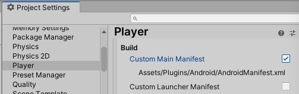
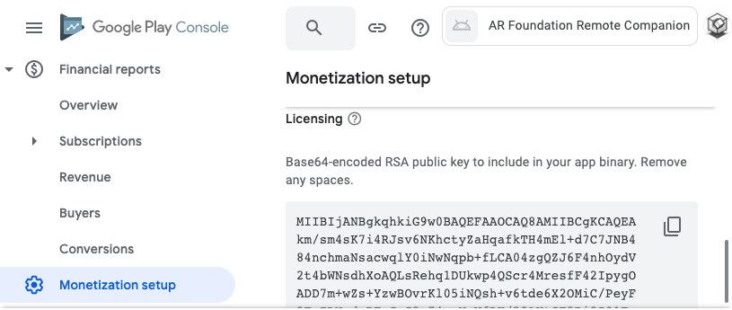
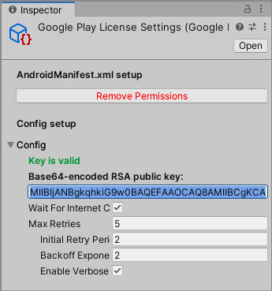
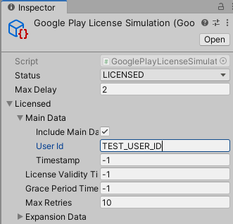
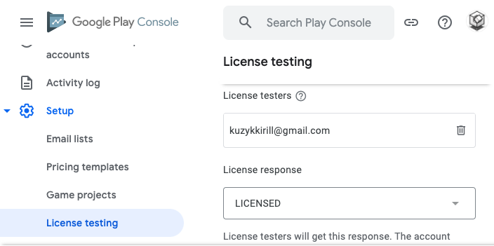

# Installation and setup
1. Import the plugin from the [Asset Store](https://assetstore.unity.com/packages/slug/227317).  
2. Enable this setting in Unity Editor:  
'Project Settings/Player/Android/Publishing Settings/Build/**Custom Main Manifest**'. This will create a default 'AndroidManifest.xml' at the 'Plugins/Android' folder.  

    

3. Select plugin's settings: 'Assets/Plugins/Google Play License Check/Resources/**GooglePlayLicenseSettings**.asset'.   
4. Press the '**Add permissions**' button. 
5. Confirm the Android **Package Name** is correct. You can set it up here: 'Project Settings/Player/Android/Identification/Package Name'. 
6. Paste your public key to 'Config/**Base64-encoded RSA public key**'. You can find your public key here: 'Google Play Console/YOUR_APP/Monetization setup/Licensing/Base64-encoded RSA public key'.

    
    

7. (Optional) Import examples into your project by pressing the 'Installer/**Import Examples**' button. The plugin will open the Package Manager window. Press the 'Samples/Import' button at the bottom of the plugin's description.

# Testing in Unity Editor
To simulate licensing responses in Unity Editor, please select the 'GooglePlayLicenseSimulation.asset' that is located here: 'Assets/Plugins/Google Play License Check/Resources/**GooglePlayLicenseSimulation**.asset'.  
In the Inspector, you can choose the license status that will be simulated in the Editor. You can additionally tweak the responses to adjust them for your specific testing scenarios.  

    

# Testing on real Android devices
To test licensing on real Android devices, you must upload your app at least once to the Internal or Closed/Open testing track on Google Play Console.
### Internal testing track
When you upload your app to the Internal testing track, your app will be in an unpublished 'draft' state. After uploading the first build, you can only reproduce two licensing responses: LICENSED and NOT_LICENSED.
1. Upload your app to the Internal Testing section on the Google Play Console.
2. To reproduce the LICENSED response, log in to Google Play with your publisher or internal tester's account.
3. To reproduce the NOT_LICENSED response, log out of Google Play.

To simulate other license responses, you must publish your app to the Closed or Open testing track. Please see the 'Closed/Open testing track' section.  
### Closed/Open testing track
To simulate all available licensing responses on a real Android device, you must upload your app to a **Closed** or **Open** testing track.  
**Please note** that after uploading your app to the Closed or Open testing track, you will be able to test your app with 'License testing' for approximately a month. When this time is passed, the 'License testing' will stop working in local builds, and you have to upload your app again to Google Play Console.  
1. Publish your app to the **Closed** or **Open** testing track. Before submitting your app to the Closed or Open testing track, you must complete the store listings and upload necessary graphics resources to Google Play Console.
2. Open the '**License Testing**' section by going to 'Google Play Console/Setup/License Testing'. 
3. Add emails of your testers to the '**License testers**' list. 
4. Choose the '**License response**'. The licensing server will simulate this response for the list of 'License testers'. **Please note** that changing the simulated response may take up to 20 minutes to take effect.  

    

# How to uninstall
1. Press the 'GooglePlayLicenseSettings/Remove Permissions' button. 
2. Press the 'Installer/Uninstall Plugin' button. 
3. Delete the folder: 'Assets/Plugins/Google Play License Check'.

# Support
Please submit bug reports [here](https://github.com/KirillKuzyk/Google-Play-License-Check/issues).  
Submit your questions and feature requests [here](https://github.com/KirillKuzyk/Google-Play-License-Check/discussions).  
If you want to contact me privately, please drop me an email: kuzykkirill@gmail.com
